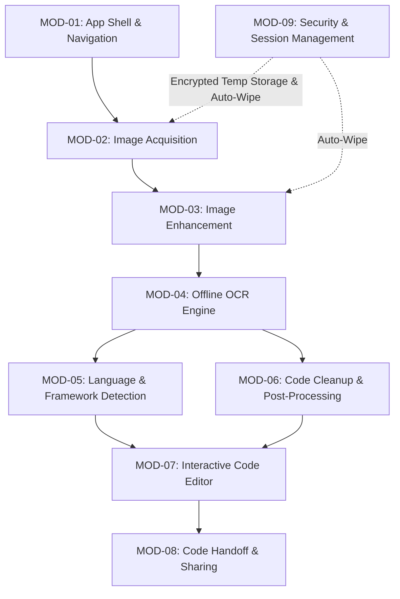

# 🔒 SecureCode OCR

<p align="center">
  <strong>Privacy-First, Offline-First Mobile Code Scanner & IDE for Android</strong>
</p>

<p align="center">
  
  
  
  
  
</p>

---

## 🌟 Overview

**SecureCode OCR** is an enterprise-grade, privacy-focused Android mobile application designed to instantly extract clean, editable source code from screenshots, photos, and IDE code snippets.

Built with **Flutter** and powered by **Google ML Kit Text Recognition**, SecureCode OCR runs **100% on-device**. No code or images are ever uploaded to cloud servers, ensuring complete IP protection for confidential codebases, private keys, and proprietary algorithms.

---

## ✨ Key Features

- **📱 Dual Acquisition Paths**: Capture live code photos with real-time viewfinder or import screenshots from gallery.
- **🎨 Interactive Image Enhancement**: 8-handle Crop tool with rule-of-thirds grid, 90° & free rotation, contrast, brightness, and noise reduction filters.
- **⚡ 100% Offline OCR Engine**: On-device text recognition delivering >95% character accuracy in under 3 seconds.
- **🧠 10+ Language & Framework Classifier**: Auto-detects C#, JavaScript, TypeScript, React, Angular, .NET / ASP.NET, HTML, SQL, Python, Dart/Flutter, JSON/XML, and Stack Traces.
- **🧹 Automated Code Cleanup**: Strips IDE line numbers (`1  `, `12 | `), removes gutter noise, fixes common OCR typos (`c1ass` ➔ `class`), and flags low-confidence lines with warning markers.
- **💻 Lightweight Code Editor**: Live code editing, Undo/Redo stack, search bar with line match highlights, Word Wrap toggle, and Cleaned vs Raw output switch.
- **📤 Privacy-Audited Sharing**: User-initiated sharing via native Android Share Sheet with 100% plain text payload (metadata and local file paths stripped).
- **🛡️ Auto-Wipe Session Security**: Lifecycle observer automatically deletes all temporary image files from encrypted session storage when the app is paused or closed.

---

## 🏗️ 9-Module Architecture System

SecureCode OCR is engineered using a modular, decoupled architecture:



| Module | Name | Primary Function |
|--------|------|------------------|
| **MOD-01** | App Shell & Navigation | Material 3 Dark/Light themes, Inter + JetBrains Mono fonts, GoRouter navigation |
| **MOD-02** | Image Acquisition | Camera capture and gallery selection with zero permanent device storage |
| **MOD-03** | Image Enhancement | Pre-OCR image preprocessing (crop, rotate, contrast/brightness, denoise filter) |
| **MOD-04** | Offline OCR Engine | On-device Google ML Kit Text Recognition with character confidence metrics |
| **MOD-05** | Language Detection | Rule-based classifier for 10+ programming languages & frameworks |
| **MOD-06** | Code Cleanup | Strips line numbers, IDE gutter artifacts, and fixes code typos |
| **MOD-07** | Code Editor | Monospaced editor with Undo/Redo, search bar, line numbers, and Raw/Cleaned toggle |
| **MOD-08** | Secure Handoff | Plain-text payload builder for native Android Share Sheet |
| **MOD-09** | Security & Session | Encrypted session directories & lifecycle auto-cleanup on app pause/kill |

---

## 🛠️ Tech Stack & Dependencies

- **Framework**: Flutter 3.10+ / Dart 3.0+
- **State Management**: Flutter Riverpod (`flutter_riverpod`)
- **Navigation**: GoRouter (`go_router`)
- **OCR Engine**: Google ML Kit Text Recognition (`google_mlkit_text_recognition`)
- **Image Processing**: Image package (`image`)
- **Security & Storage**: Flutter Secure Storage (`flutter_secure_storage`) & Path Provider (`path_provider`)
- **Permissions**: Permission Handler (`permission_handler`)
- **Sharing**: Native Share Plus (`share_plus`)

---

## 🚀 Getting Started

### Prerequisites

- [Flutter SDK](https://docs.flutter.dev/get-started/install) (v3.10.5 or higher)
- [Android SDK](https://developer.android.com/studio) (API 26 / Android 8.0 or higher)
- Java Development Kit (JDK 17)

### Installation & Setup

1. **Clone the Repository**:
   ```bash
   git clone https://github.com/talha281/SecureOCR-App.git
   cd SecureOCR-App
   ```

2. **Install Dependencies**:
   ```bash
   flutter pub get
   ```

3. **Verify Project Health**:
   ```bash
   flutter analyze
   ```

4. **Run on Connected Device**:
   ```bash
   flutter run
   ```

---

## 📦 Building the Release APK

To generate a lightweight, production-optimized APK split by device architecture:

```bash
flutter build apk --release --split-per-abi
```

The output APKs will be located at:
- **arm64-v8a** (Modern Android Devices): `build/app/outputs/flutter-apk/app-arm64-v8a-release.apk` (~28.5 MB)
- **armeabi-v7a** (32-bit Devices): `build/app/outputs/flutter-apk/app-armeabi-v7a-release.apk` (~22.9 MB)

---

## 🛡️ Security & Privacy Guarantees

1. **Zero Cloud Network Calls**: OCR extraction runs 100% on-device inside the local app process.
2. **No Permanent External Writes**: Images captured or selected are stored ONLY in temporary session directories.
3. **Session Auto-Wipe**: Upon app pause or termination, `SessionManager` immediately purges all temp image files.
4. **Metadata-Free Sharing**: Shared code contains plain text only — no local file paths, timestamps, or image bytes.

---

## 📂 Project Structure

```
SecureOCR-App/
├── .docs/                        # PRD, Product Vision, KPIs, & Module Specifications
├── android/                      # Android native configuration (minSdk 26, ProGuard rules)
├── lib/
│   ├── main.dart                 # Entry point & Riverpod scope
│   ├── core/                     # Theme system, router, constants, & error boundary
│   │   ├── constants/
│   │   ├── errors/
│   │   ├── router/
│   │   └── theme/
│   ├── modules/                  # Modular application architecture
│   │   ├── acquisition/          # MOD-02: Camera & Gallery picker
│   │   ├── cleanup/              # MOD-06: Line number & noise stripper
│   │   ├── detection/            # MOD-05: Language & framework classifier
│   │   ├── editor/               # MOD-07: Editor state & search notifier
│   │   ├── enhancement/          # MOD-03: Crop overlay & image filters
│   │   ├── ocr/                  # MOD-04: ML Kit OCR engine & models
│   │   ├── security/             # MOD-09: Encrypted storage & session manager
│   │   └── sharing/              # MOD-08: Plain text Share Sheet handler
│   └── screens/                  # App screens
│       ├── home_screen.dart      # Home hero screen with Scan/Import CTAs
│       ├── preview_screen.dart   # Image preview with enhancement toolbar
│       ├── processing_screen.dart# Animated OCR scanning & metrics display
│       └── editor_screen.dart    # Code editor with Raw/Cleaned switch & search
├── pubspec.yaml                  # Dependencies and assets configuration
└── README.md                     # Project documentation
```

---

## 🤝 Contributing

Contributions are welcome! Please feel free to submit a Pull Request or open an issue for bug reports and feature requests.

---

## 📄 License

This project is licensed under the [MIT License](LICENSE).
